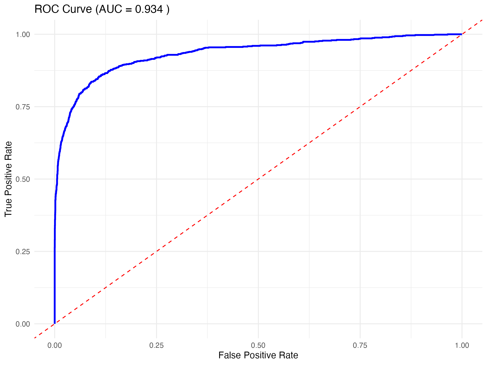

Create project README
# 🏥 Healthcare Cost Prediction using MEPS Data

Predictive analytics project that identifies persistent high-cost patients using longitudinal Medical Expenditure Panel Survey (MEPS) data.

---

## 📌 Project Overview

Healthcare spending is highly concentrated, with a small percentage of patients accounting for a significant share of overall costs. This project develops a predictive model to identify individuals at risk of becoming persistent high-cost patients, enabling earlier intervention and better healthcare resource planning.

---

## 🎯 Objective

Develop a machine learning–based predictive model that identifies patients likely to remain in the highest healthcare expenditure group over a two-year period.

---

## 📊 Dataset

**Source:** Medical Expenditure Panel Survey (MEPS)

The analysis uses longitudinal healthcare data including:

- Demographic information
- Insurance coverage
- Chronic disease indicators
- Healthcare expenditure
- Survey weights

> **Note:** The original dataset is not included in this repository.

---

## 🔬 Methodology

- Data Cleaning
- Feature Engineering
- Survey-weight Adjustment
- Logistic Regression
- Model Evaluation
- Risk Stratification

---

## 📈 Model Performance

| Metric | Score |
|--------|-------|
| AUC | 0.934 |
| Accuracy | 81.9% |
| Sensitivity | 90.1% |
| Specificity | 80.8% |

---

## 💡 Key Findings

- Previous healthcare expenditure was the strongest predictor.
- High-risk patients were accurately identified using demographic and clinical variables.
- The model can support targeted care management and healthcare resource allocation.

---

## 🖼️ Project Visuals

### Dashboard

### ROC Curve

### Risk Stratification

### Model Performance

---

## 🛠️ Technologies Used

- R
- Logistic Regression
- Shiny
- MEPS
- Predictive Analytics
- Statistical Modelling

---

## 📄 Project Files

- 📘 Final_Project_Report.pdf
- 📊 Project_Presentation.pptx

---

## 🚀 Future Improvements

- Compare with Random Forest and XGBoost
- Deploy an interactive web dashboard
- Improve model explainability
- Validate using additional healthcare datasets

---

## 👤 Author

**Shyamsundar Nandakumar**

MS in Analytics | Northeastern University
